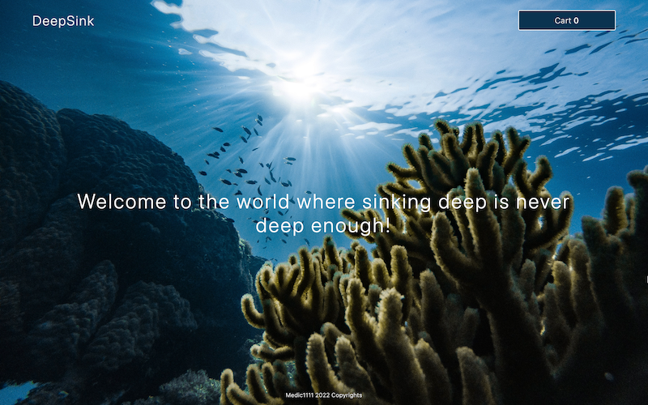
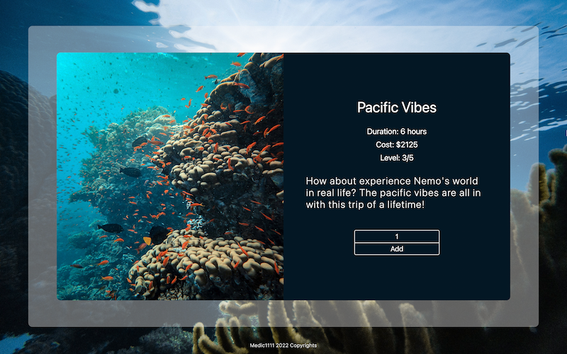

# DEEP_ZONE:

[Live App](https://deepsink-133ff.web.app/)





## WHAT IS IT?

A scubadiving trip selling app, front-end only, with intentions to use some of the most common ReactHooks and principals.

Entirely for practice.

## INSTALL

1. Fork the project
2. Select its url on your forked repo
3. Open your terminal and run `git clone` followed by the url
4. Go into the client folder
5. Run `npm install`
6. Once dependencies are installed, run `npm start`

## THE PROJECT

I'm an ocean lover and therefore it wasn't gonna be long until I decided to do something diving related.

It turns out, bad diving shop websites are basically ALL there is.

Usually outdated and with horrible navigation, those websites that I am so often visiting, led me to consider this a problem-solving project

## THE SOLUTION

Take 2 and 2 and make it 4. Having a easy to navigate, simple as usually my projects are, intuitive application, while practicing some of those ReactJS core concepts

### START

- Download the project and open in your favourite IDE

- On your terminal, write the command to go into the client folder: cd client

- THen, write the command to install all dependencies: npm install

- Now, while still in the client folder, run the command: npm start

- localhost:3000 now should display the app

### React Skills Demonstration: Front End

- Portals: Enhancing SEO and maintaining semantic HTML
- Wrappers: Avoiding Tags used for styling purposes only and minimizing Divs
- useContext: Keeping a leaner logic and avoiding passing props to components that won't use it, but rather serve as bridges
- useState: Basic hook of any React content-dynamic App
- JS: Data Structure, Map, Filter

### PLANNING:

> index.js

- Utilizes the newest ReactDom createRoot() syntax

> App.js

- Renders: 5 Components, with one being conditional : Cart, and two being static only: Hero, Footer

- Also renders a Wrapper

```
        <BackWrapper>
            {isModal ? <Cart /> : null}
            <Nav />
            <Hero />
            <DiveList />
            <Footer />
        </BackWrapper>
```

- Components that are reactive: Nav, DiveList, Cart

> Conditionals

- Cart is rendered contionally. Depends on whether or not Modal is open.

- Modal is a PORTAL components

> Reactive comps

- Nav

  Uses two contexts. ModalCtx to open and close the cart. And the cartItemCtx to gather the total amount of dives that have been added to the cart and display.

  The total amount adds from the FORM when ADD btn is pressed, and SUBTRACTED when the remove btn in the cart is pressed

1. Add dives when ADD btn is pressed on the FORM
2. Subtract dives when the REMOVE btn is pressed on the cartItem

- Dive List

  Simply maps the data located in the data directory along with a form for each item. The form allows for choosing the amount of divers and add it to the cart. It also pushes the item along with the amount to the context dive array, which is originally empty

- Cart

  Renders from the context, the dives previously added, displays the total cost, the total dives, and the option to close the cart or go to check out. Closing the cart alters the Modal.

- Cart CheckOut: Will render another portal

  Checking out will render a new modal, via portal, explaining its the end of the demo project., As well as allow for modal closing via button, likely using context for the new modal.

> ARYSE TANSY: Self-taught full-stack web developer on a life-long journey of learning and applying new skills.
